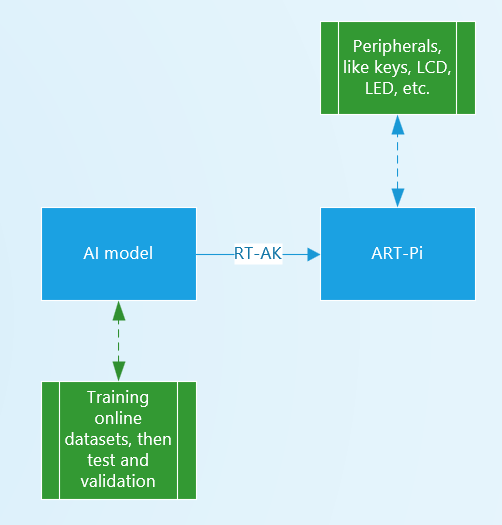
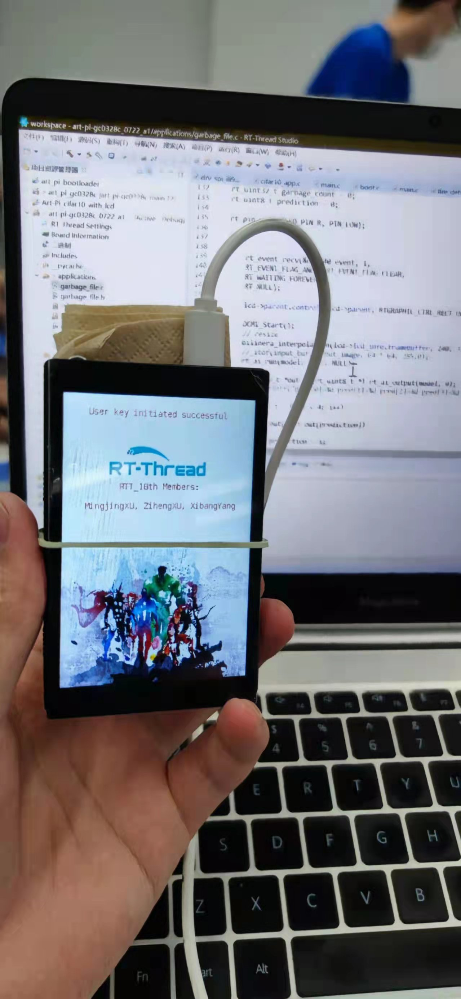

# Garbage Classification Device at Embedded AI Summer School 2021 of NICT
It works as a waste separator for roadside litter bins to help remind pedestrians to separate their rubbish when they throw it away.

And the following is a flow chart of the project:

Here is a picture of how it looks like in my hand:

You can view a [demo](https://www.bilibili.com/video/BV1fg411K7kh?spm_id_from=333.999.0.0) of the device on Bilibili.
